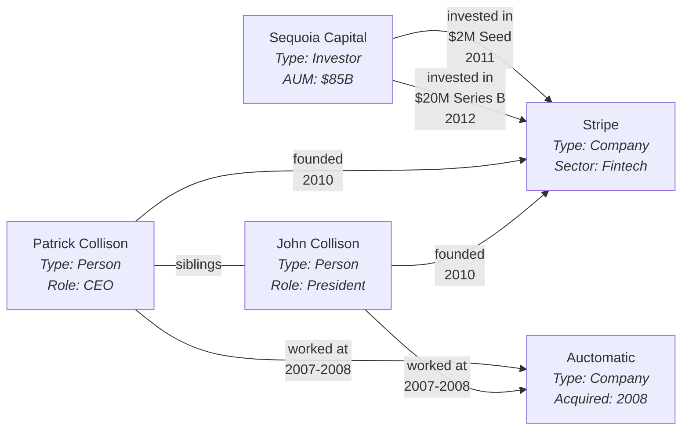

## Overview

Companies don't exist in isolation. They have investors, employees, competitors, customers, suppliers, and potential acquirers. Founders move between companies. Investors co-invest together. Companies get acquired by larger companies in adjacent markets. Understanding these relationships is often as important as understanding the companies themselves.

Traditional relational databases are optimized for storing structured data in tables. They work well for tracking companies, investments, and people as individual entities. But when you need to query relationships between entities (who invested in companies that competed with this portfolio company? which founders worked together at previous companies? what's the network of potential acquirers for this company?), relational databases become awkward. You end up writing complex joins across many tables, and performance degrades as you traverse multiple levels of relationships.

Knowledge graphs are designed specifically for relationship-heavy data. They represent entities as nodes and relationships as edges. Queries that would require complex joins in a relational database become natural graph traversals. This makes them particularly powerful for certain VC use cases: market mapping, competitor analysis, finding similar companies, tracking networks of people and investors, and understanding acquisition patterns.

But knowledge graphs and graph databases come with their own complexity. They're harder to work with than relational databases. Most engineering teams are more comfortable with SQL than with graph query languages like Cypher or Gremlin. Graph databases have different performance characteristics and require different thinking about data modeling.

This chapter covers what knowledge graphs are, why they matter for VC, when to use them versus sticking with relational databases, and how to approach implementation without over-complicating your infrastructure.

## What Are Knowledge Graphs?

A knowledge graph represents information as a network of entities (nodes) and their relationships (edges). Instead of organizing data into tables with rows and columns, you organize it as a graph where each node represents something (a company, a person, an investor) and each edge represents a relationship between two nodes (works at, invested in, acquired by).

**Nodes** are entities. In a VC knowledge graph, nodes might represent companies, people, investors, funding rounds, or products. Each node can have properties. A company node might have properties like name, founding date, sector, and description. A person node might have name, title, and LinkedIn URL.

**Edges** are relationships between nodes. These can be directional (Alice works at Acme Corp) or bidirectional (Company A competes with Company B). Edges can also have properties. An "invested in" edge might have properties like investment date, amount, and ownership percentage. A "worked with" edge between two people might have properties indicating when and where they worked together.

This is a trivial example, but it illustrates how knowledge graphs map entities and relationships. Nodes have properties (company sector, person role, investor AUM) and edges have properties (investment amount, dates). Graph queries can traverse these relationships: "find all companies founded by people who previously worked together" returns Stripe by following the "worked at" edges from the Collisons to Auctomatic. A real knowledge graph would have thousands of nodes and millions of edges, but the structure is the same.

**Graph databases** are databases optimized for storing and querying graph data. They make it efficient to traverse relationships. Instead of joining tables, you follow edges. Queries like "find all companies within 3 degrees of separation from this investor that operate in the same sector" are natural in graph databases but painful in SQL.

**The difference from relational databases**: In a relational database, you might have a companies table, a people table, an investments table that links companies to investors, and an employment table that links people to companies. To answer "which companies did investors who funded my competitor also fund?" requires joining investments table to itself through companies, then joining again to get company details. In a graph database, you start at your competitor node, follow "invested in" edges to investor nodes, follow their other "invested in" edges to company nodes, and you're done.

## Why Knowledge Graphs Matter for VC

Venture capital is fundamentally about networks and relationships. Understanding these relationships helps with deal flow, diligence, portfolio support, and exits.

**Market mapping**: When you're researching a sector, you don't just want a list of companies. You want to understand how they relate to each other. Which companies compete directly? Which are upstream suppliers or downstream customers? Which companies were founded by people who worked together previously? A knowledge graph makes it natural to visualize and query these relationships, turning a flat list of companies into a network that shows market structure.

**Competitor analysis**: For portfolio companies or potential investments, understanding the competitive landscape means knowing not just who the competitors are, but how they're connected. Do they share investors? Do they target the same customers? Have they hired from each other? These relationship patterns reveal competitive dynamics that a flat database misses.

**Company similarity**: Finding similar companies is valuable for sourcing (if we liked this investment, what else is similar?) and benchmarking (how does our portfolio company compare to similar companies?). Similarity based on relationships (same investors, same hiring sources, same partners) often reveals more than similarity based on keywords or sector tags. **EQT's CompanyKG** (1.17M companies, 51M edges representing 15 relationship types) focuses heavily on this, quantifying similarity through network structure and company description embeddings. They benchmarked 11 different methods, validating that relationship data is valuable enough to build serious infrastructure around.

**Network analysis, M&A patterns, investment patterns**: Tracking who knows whom, which investors co-invest, which companies acquire others, which founders worked together. Knowledge graphs make these network queries natural. Understanding acquisition paths, warm intro paths, and investor syndicate behavior all emerge from relationship data.

**Identifying tech hubs**: Knowledge graphs reveal entrepreneurial concentrations. Which companies are "founder factories" (PayPal, Google, Stripe)? Which universities produce the most founders in your sectors? A graph query can show that 15 AI infrastructure companies were founded by people who worked at Meta's infrastructure team, suggesting a network worth watching.

## GraphRAG: Knowledge Graphs for AI Systems

An emerging application of knowledge graphs in VC is GraphRAG (Graph Retrieval-Augmented Generation). This combines knowledge graphs with large language models to improve how AI systems retrieve and reason about your data.

**What is GraphRAG?**: Traditional RAG systems retrieve relevant documents or text chunks based on similarity to a query, then feed those chunks to an LLM to generate an answer. GraphRAG enhances this by using a knowledge graph to understand relationships between entities. Instead of just retrieving similar text, it can traverse the graph to find related information that might not be textually similar but is semantically connected.

**Why it matters for VC**: When a GP asks "which companies in our portfolio are working on AI infrastructure?", a traditional RAG system might retrieve documents mentioning "AI infrastructure." But GraphRAG can understand that Company A's infrastructure product is used by Company B (even if that relationship isn't explicitly stated in searchable text), or that the founders of Company C previously worked at Company D which built similar technology. The knowledge graph captures these relationships, making retrieval smarter.

**Use cases**:

- Answering questions about portfolio company relationships ("which of our portfolio companies could partner with each other?")
- Understanding competitive landscapes ("show me companies that compete with our portfolio companies and their relationships to potential acquirers")
- Connecting research insights ("what companies are working in adjacent spaces to this thesis we developed?")
- Due diligence queries ("what are all the connections between this company and our existing network?")

**How it works**: You build a knowledge graph of your companies, people, investors, and their relationships. When someone asks a question, the system:

1. Identifies relevant entities in the question
2. Traverses the knowledge graph to find related entities and relationships
3. Retrieves documents/data associated with those entities
4. Provides both the graph structure and the documents to the LLM
5. The LLM generates an answer informed by both textual content and relationship structure

**Implementation considerations**: GraphRAG requires both a knowledge graph infrastructure and an LLM integration. You need clean entity resolution (covered in [Entity Resolution](/guide/part-3-technical-foundations/entity-resolution)) so the graph accurately represents reality. You need good data quality so the LLM doesn't hallucinate based on incorrect relationships. And you need to decide whether GraphRAG's benefits justify the additional complexity over simpler RAG approaches.

For most funds, this is still emerging territory. Traditional RAG systems work well for searching documents and research. GraphRAG becomes valuable when relationship-based reasoning is critical to answering questions. If you're already building a knowledge graph for market mapping or competitor analysis, adding GraphRAG capabilities might be a natural extension. But don't build a knowledge graph just to enable GraphRAG unless you have validated that relationship-based retrieval solves problems traditional search doesn't.

## When to Use Knowledge Graphs vs. Relational Databases

Knowledge graphs are powerful, but they're not always the right choice. The decision depends on your queries, your team's expertise, and your infrastructure maturity.

**Use knowledge graphs when:**

- Your core queries involve traversing multiple levels of relationships (find companies 2-3 hops away through investor networks)
- You need to visualize network structure (market maps showing company relationships)
- Relationship patterns are as important as entity attributes (co-investment networks, competitive clusters)
- You're building recommendation systems based on graph similarity (companies similar to this one based on their network position)

**Stick with relational databases when:**

- Most queries are about entity attributes, not relationships (show me all Series A companies in fintech)
- Your team is much more comfortable with SQL than graph query languages
- You're still figuring out your data model and need flexibility to change it
- Performance for your use cases is fine with relational databases

**The hybrid approach (recommended):**

For most VC funds, the right answer is to model everything in a relational database first, then build knowledge graph views or projections on top when you need relationship-heavy queries.

**Why this works:**

- Your team already knows SQL. Teaching everyone Cypher or Gremlin adds complexity.
- Relational databases are well-understood, mature, and have great tooling.
- Most of your queries are probably fine in SQL. It's only specific relationship queries that benefit from graphs.
- You can start simple and add graph capabilities later when you validate the need.

**How to implement this:**

- Model your core data (companies, people, investors, deals) in Postgres or similar relational database
- Ensure you capture relationships (investments, employment, board seats, partnerships)
- For basic relationship queries, use SQL joins (they work fine for 1-2 levels of relationships)
- When you need complex graph queries, either:
  - Build a materialized view in a graph database (periodically sync data from the relational database to the graph database)
  - Use graph algorithms directly on your relational data (libraries like [NetworkX](https://networkx.org/) in Python can build graphs from relational queries)
  - Query your relational database and build graph structures in your application layer when needed

This gives you the benefits of graph thinking without committing to graph databases before you need them.

## Implementation Considerations

If you do decide to use a graph database (either as your primary store or as a secondary system), here are key considerations.

**Graph database options:**

- **[Neo4j](https://neo4j.com/)**: Most popular graph database, mature ecosystem, Cypher query language. Good developer experience and tooling.
- **[Amazon Neptune](https://aws.amazon.com/neptune/)**: Managed graph database on AWS, supports both Gremlin and SPARQL. Good if you're already on AWS.
- **[Memgraph](https://memgraph.com/)**: In-memory graph database startup with focus on streaming data and real-time analytics. Compatible with Neo4j's Cypher query language.
- **[FalkorDB](https://www.falkordb.com/)**: Graph database startup built on Redis, emphasizing low latency and high throughput. Also uses Cypher. Good for real-time applications.

Note that Memgraph and FalkorDB are newer startups, whereas Neo4j and Neptune are more established with larger ecosystems and enterprise support.

**Data modeling**: Graph data modeling is different from relational modeling. You need to think about what should be nodes vs. properties (is a funding round a node or a property of an investment edge?), how to model time-varying relationships (person worked at company from date X to date Y), and how to handle different relationship types with different semantics.

**Query performance**: Graph databases are optimized for traversals, but performance depends heavily on your graph structure and query patterns. Highly connected nodes (like major investors) can become bottlenecks. You may need to denormalize data or add specialized indexes.

**Data freshness**: If you're maintaining both a relational database and a graph database, you need to keep them in sync. This usually means ETL processes that run periodically (nightly or weekly). Real-time sync is possible but adds significant complexity.

**Team expertise**: Graph databases require different mental models than relational databases. Your team needs to learn graph query languages, understand graph algorithms, and think differently about data modeling. This is an investment. Make sure it's worth it for your use cases.

## The Bottom Line

Knowledge graphs are powerful for relationship-heavy queries: market mapping, competitor analysis, network effects, and similarity calculations. They represent how companies, people, and investors connect, which is often as important as the entities themselves.

But don't start with a graph database. Most VC funds should model their data in relational databases first. Relational databases are well-understood, your team knows SQL, and they work fine for most queries. Only when you have validated use cases for complex relationship queries should you add graph capabilities.

The hybrid approach works best: model everything in Postgres or similar, then build knowledge graph projections on top when you need them. This could mean materializing data into Neo4j for specific analyses, using graph libraries on top of your relational data, or building graph views in your application layer.

EQT's CompanyKG demonstrates the value of knowledge graphs for VC at scale: 1.17 million companies, 51 million relationships, powering market mapping, competitor analysis, and company similarity. But they built this as a research project on top of their existing Motherbrain platform, not as a replacement for it.

If relationship queries become core to your competitive advantage, invest in proper graph infrastructure. Until then, model your relationships clearly in relational databases and build graph capabilities as needed.

In the next chapter, we'll cover integrations and APIs: common patterns for connecting VC tools, validating API responses, handling webhooks and rate limits.
